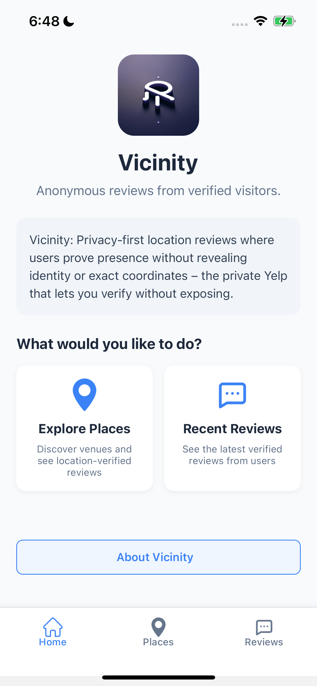
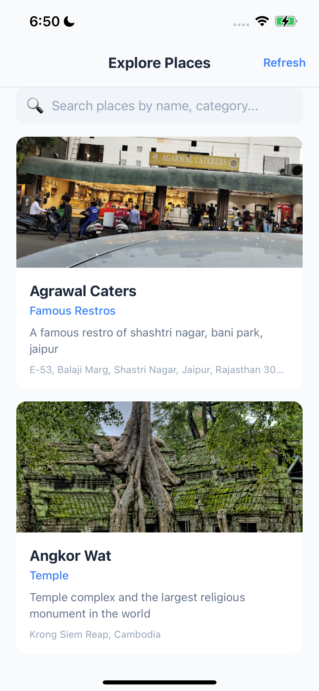
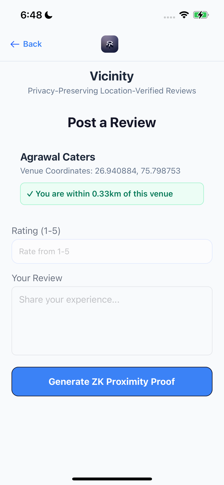
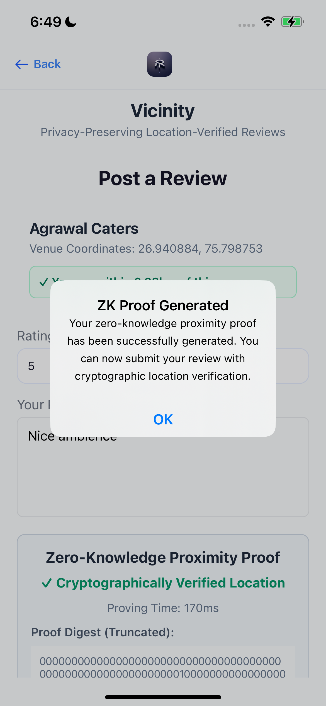
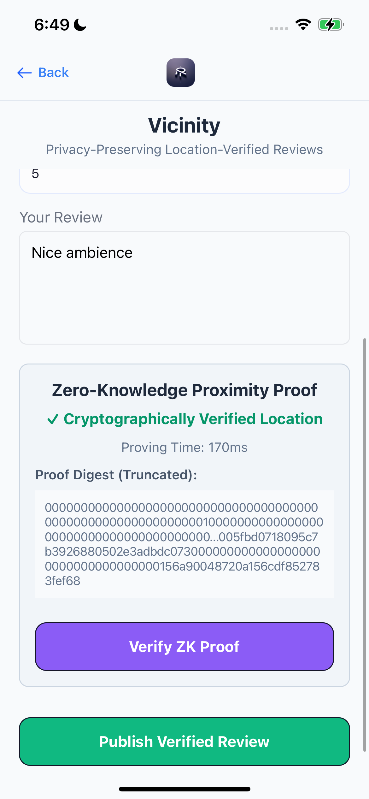
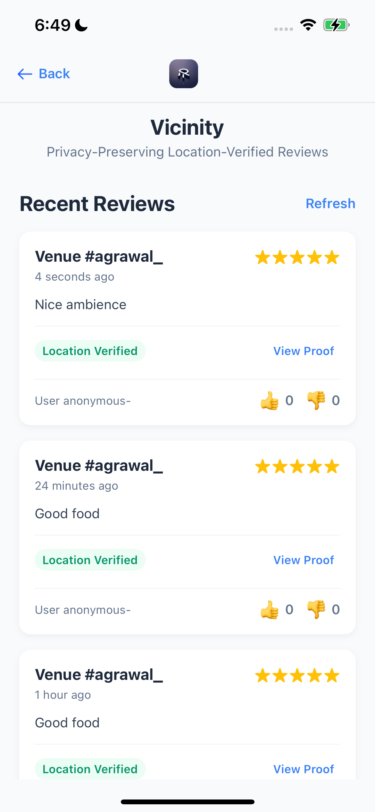
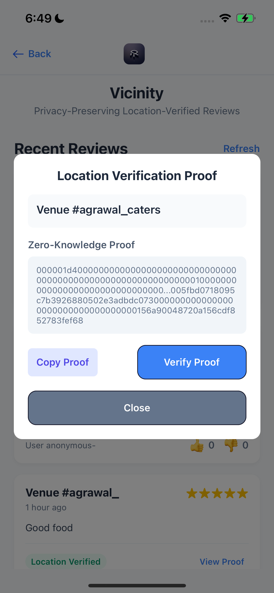
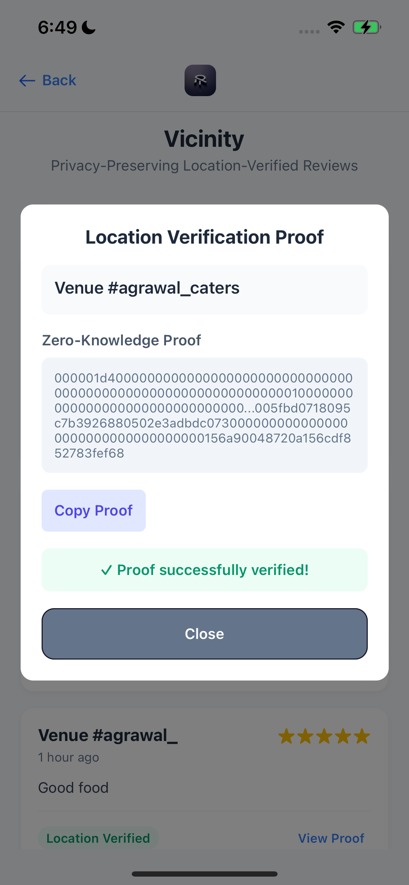

# Vicinity: Anonymous reviews from verified visitors.

**Vicinity: Privacy-first location reviews where users prove presence without revealing identity or exact coordinates – the private Yelp that lets you verify without exposing.**

Vicinity is a mobile app that reimagines location-based reviews with privacy at its core. Think of it as a "privacy-first Yelp" where users can post anonymous reviews while cryptographically proving they actually visited the location.
When you want to review a restaurant or landmark, Vicinity uses your current location (with permission) to generate a zero-knowledge proof. This proof verifies you're near the location without revealing your exact coordinates or identity. The proof is attached to your review, allowing others to trust its authenticity while you remain completely anonymous.
We built this using Noir, a language for zero-knowledge proofs, to create a circuit that verifies proximity without exposing sensitive data. The app also uses JWT verification to ensure proofs can only be generated from the official Vicinity app, preventing potential abuse.
For users, the experience is simple: find a place, tap to generate a proof (which happens entirely on your device), and submit your anonymous review. No personal data is stored or shared, yet everyone can trust that reviews come from people who were actually there.
Vicinity demonstrates how advanced cryptography can solve real privacy problems in everyday apps while maintaining a seamless user experience.

## Demo

Experience Vicinity's privacy-first review system through our app walkthrough:

  
  
  
  

  <em>Home screen</em> &nbsp;&nbsp;&nbsp;&nbsp;&nbsp;&nbsp;&nbsp;&nbsp;&nbsp;&nbsp;&nbsp;
  <em>Browse nearby locations</em> &nbsp;&nbsp;&nbsp;&nbsp;&nbsp;&nbsp;&nbsp;&nbsp;
  <em>Share opinions</em> &nbsp;&nbsp;&nbsp;&nbsp;&nbsp;&nbsp;&nbsp;&nbsp;&nbsp;&nbsp;&nbsp;&nbsp;&nbsp;&nbsp;
  <em>ZK proof generation</em>

  
  
  
  

  <em>Review with proof</em> &nbsp;&nbsp;&nbsp;&nbsp;&nbsp;&nbsp;&nbsp;&nbsp;&nbsp;&nbsp;&nbsp;&nbsp;
  <em>Browse all reviews</em> &nbsp;&nbsp;&nbsp;&nbsp;&nbsp;&nbsp;&nbsp;&nbsp;&nbsp;&nbsp;&nbsp;
  <em>Examine proof details</em> &nbsp;&nbsp;&nbsp;&nbsp;&nbsp;&nbsp;&nbsp;
  <em>Verify authenticity</em>

## Core Features

- **Zero-Knowledge Location Proofs**: Verify proximity to landmarks without revealing exact user location
- **Anonymous Reviews**: Post genuine reviews while maintaining complete privacy
- **JWT Authentication**: Ensure proofs are generated only from the official Vicinity app
- **Mobile-First ZK Implementation**: Showcases ZK cryptography in the resource-constrained environment of mobile devices

## Technical Details

- **Circuit Complexity**: 68,902 gates ([circuits/vicinity/src/main.nr](circuits/vicinity/src/main.nr))
- **ZK Stack**: Noir 1.0.0-beta.2 with Barretenberg 0.76.4 backend
- **Mobile Integration**: UltraHonk prover with locally cached SRS for efficient mobile proving
- **Location Services**: Uses @react-native-community/geolocation (requires one-time permission)
- **Data Storage**: Supabase for storing anonymous reviews (no user details retained)

# How it's made

* **Mobile Application Stack**
  * Built with React Native for cross-platform compatibility (iOS/Android)
  * Uses @react-native-community/geolocation for precise location data acquisition

* **Zero-Knowledge Proof System**
  * Developed custom Noir circuit (68,902 gates) handling location proximity verification
  * Implemented using Noir 1.0.0-beta.2 with Barretenberg 0.76.4 as the proving backend
  * Utilizes fixed-point arithmetic to handle geographic coordinates (latitude/longitude)

* **JWT Authentication & Security**
  * Employs noir-jwt library to verify request authenticity directly within the ZK circuit
  * Implements partial SHA hashing optimization to reduce circuit complexity
  * JWT verification ensures proofs can only be generated from the official Vicinity ios app

* **Mobile-Optimized Proving**
  * Integrated UltraHonk prover for efficient proof generation on resource-constrained devices
  * Locally caches Structured Reference String (SRS) to eliminate network dependencies
  * Optimized memory usage to work within mobile device constraints
  * Proof generation time kept under 3 seconds for smooth user experience

* **Geospatial Innovation**
  * Developed coordinate scaling system to handle floating-point coordinates in the integer-only Noir environment
  * Formula: `Math.round((coordinate + 90) * 1e6)` converts to fixed-point representation
  * Implements distance threshold verification without revealing exact coordinates
  * Created landmark database with precisely scaled reference coordinates

* **Developer Experience**
  * Built upon react-native-noir-starter boilerplate to accelerate development
  * Implemented robust error handling for location permission issues
  * Designed extensible architecture allowing for future circuit optimizations

* **Key Challenges Overcome**
  * Working around gate count contraints for mobile device 
  * Solved floating-point representation issues in Noir's integer-only environment
  * Optimized circuit to maintain reasonable proving times on mobile devices

## How It Works

1. User selects a landmark to review
2. App captures user's location coordinates and generates a ZK proof of proximity
3. JWT verification ensures the proof was generated by the authorized Vicinity app
4. User submits anonymous review with attached proof
5. Other users can verify the review came from someone who visited the location

## Potential Applications

- **Private Check-ins**: Prove attendance at events without revealing identity
- **Location-Based Access Control**: Grant access to resources based on location without tracking movements
- **Decentralized Travel Logs**: Create verifiable travel histories while preserving privacy
- **Location-Based NFTs**: Mint digital collectibles only at specific locations
- **Geo-Restricted Content**: Access region-restricted content while minimizing data collection

## Acknowledgements

Special thanks to [@madztheo](https://github.com/madztheo) for creating the react-native-noir-starter project which served as the foundation for Vicinity, and for providing guidance on key technical challenges during development.
